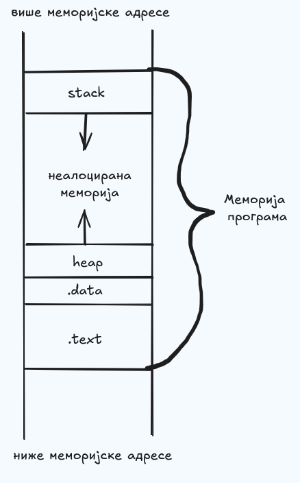
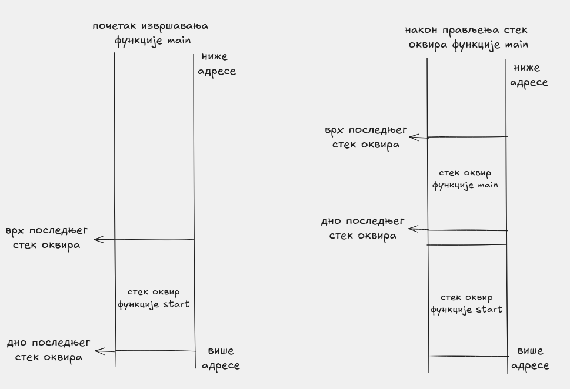
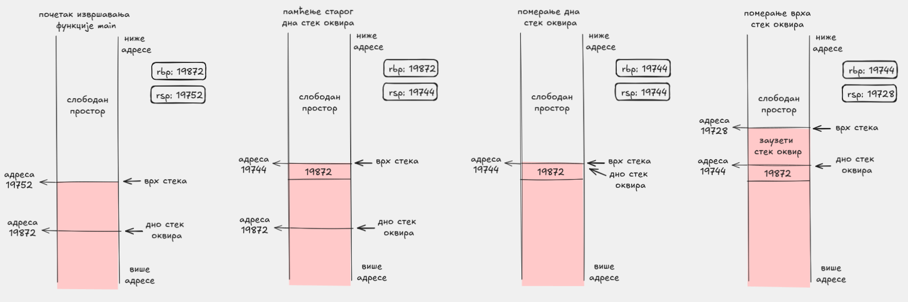
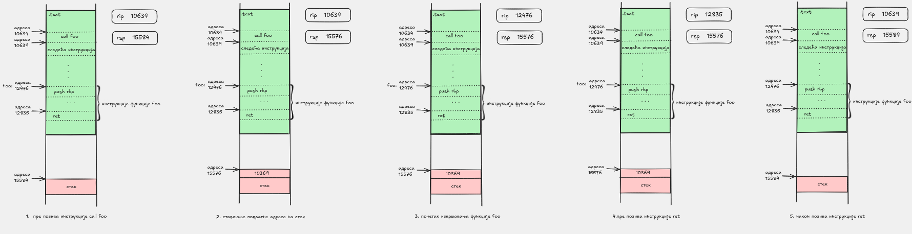

# Организација извршног кода

## Од изворног кода до покретања програма

На курсу „Увод у програмирање“ сте писали своје прве програме у језику C++. На овом курсу је циљ да мало ближе разумемо како се ти програми заиста извршавају на рачунару и шта је то што рачунар „види“ када покушамо да покренемо програм.

Претпоставимо да сте написали програм у датотеци `program.cpp`. Покретање тог програма у терминалу може да изгледа овако:

```sh
$ g++ program.cpp
$ ./a.out
# интеракција са програмом
```

Наредбом `g++ program.cpp` покрећете компајлер, који за Вас прави датотеку `a.out`. Шта је тачно та датотека можемо видети помоћу програма `file`:

```sh
$ file a.out
a.out: ELF 64-bit LSB pie executable, x86-64, version 1 (SYSV), dynamically linked, interpreter /lib64/ld-linux-x86-64.so.2, BuildID[sha1]=75e5c89080bd36fc3098fa6f5b4e146f12f22b22, for GNU/Linux 3.2.0, not stripped
```

## Шта је `ELF` датотека

Овде видимо више корисних информација. За сада је најважније да је ово `ELF 64-bit` датотека за архитектуру `x86-64`.

`ELF` је скраћеница од `Executable and Linkable Format` и представља формат у ком се налазе информације неопходне да би програм могао да се покрене. Када извршите наредбу `./a.out`, те информације чита програм који се назива пунилац (енг. `loader`) и на основу њих припрема меморију за извршавање програма.

Један од најкориснијих начина да погледамо унутрашњу структуру `ELF` датотеке јесте команда `readelf -S`:

```sh
$ readelf -S a.out
There are 31 section headers, starting at offset 0x3698:

Section Headers:
  [Nr] Name              Type             Address           Offset
  ...
  [16] .text             PROGBITS         0000000000001060  00001060
  [18] .rodata           PROGBITS         0000000000002000  00002000
  [25] .data             PROGBITS         0000000000004000  00003000
  [26] .bss              NOBITS           0000000000004010  00003010
  ...
```

У овом излазу видимо секције које су заиста уписане у саму извршну датотеку. Посебно су нам важне:

- `.text`, у којој се налазе инструкције програма
- `.rodata`, у којој се често налазе константни подаци, на пример ниске
- `.data`, у којој се налазе иницијализовани глобални и статички подаци
- `.bss`, у којој се налазе неиницијализовани глобални и статички подаци

Ако желимо сличан преглед на нешто компактнији начин, можемо користити и `objdump -h a.out`.

Важно је приметити да `stack` и `heap` нећемо видети као секције у излазу `readelf -S`. Оне су меморијске области које се користе током извршавања програма, док `readelf` приказује пре свега структуру саме `ELF` датотеке.

## Основне меморијске целине

Пунилац заузима блок меморије и дели га на више целина. За нас су најважније следеће:

- `.text` садржи инструкције које се извршавају, односно машински код програма.
- `.data` садржи податке са статичким животним веком, као што су глобалне и статичке променљиве.
- `stack` садржи податке са аутоматским животним веком, најчешће локалне променљиве.
- `heap` садржи динамички алоциране податке, на пример објекте и структуре које настају током рада програма.

### Кратак C++ пример

Следећи пример показује где би се најчешће нашле различите променљиве:

```cpp
int globalna = 5;          // .data
int neinicijalizovana;     // .bss

int main() {
    static int staticka = 7;    // .data
    int lokalna = 10;           // stack
    int* dinamicka = new int(3); // pokazivac je na stack-u, a vrednost na heap-u

    return globalna + staticka + lokalna + *dinamicka + neinicijalizovana;
}
```

У овом примеру:

- `globalna` има статички животни век и налази се у секцији `.data`.
- `neinicijalizovana` је такође глобална променљива, али пошто није иницијализована, обично завршава у секцији `.bss`.
- `staticka` је локална по домету, али статичка по животном веку, па се такође смешта у `.data`.
- `lokalna` је обична локална променљива и налази се на стеку.
- променљива `dinamicka` је локални показивач и налази се на стеку.
- вредност направљена изразом `new int(3)` налази се на heap-у.

Следећа слика даје интуитиван приказ распореда ових делова меморије у програму:



*Приказ основних меморијских целина програма. `heap` расте ка вишим адресама, а `stack` ка нижим адресама.*

## Раст стека и heap-а

`heap` и `stack` су секције које расту, али у супротним смеровима. Стек најчешће расте „надоле“, што значи да се новији подаци налазе на адресама које су мање од претходних.

Приликом писања асемблерских програма на овом курсу обраћаћемо пажњу на то у коју се секцију смештају инструкције и подаци.

## Стек оквири

Када се позове функција, она често добија свој део стека у ком чува локалне променљиве и привремене вредности. Тај део меморије називамо **стек оквир**.

У класичном облику:

- `rbp` означава базу текућег стек оквира
- `rsp` означава врх стека

Због тога се у многим функцијама на почетку појављује образац:

```asm
push rbp
mov rbp, rsp
sub rsp, ...
```

Прва слика треба да да интуитивну представу шта је стек оквир и где се у њему налазе `rbp`, `rsp`, аргументи и локалне променљиве:



*Схематски приказ стек оквира једне функције.*

### Прављење стек оквира корак по корак

Корисно је видети и како се вредности регистара `rbp` и `rsp` мењају током уласка у функцију. На пример:

1. пре уласка у функцију стек припада позиваоцу
2. после `push rbp` стара вредност `rbp` се чува на стеку
3. после `mov rbp, rsp` нови стек оквир добија своју базу
4. после `sub rsp, ...` резервише се простор за локалне променљиве

Следећа слика треба да покаже тај процес корак по корак:




### Позив функције, повратна адреса и поравнање стека

Када једна функција позове другу, инструкција `call` прво уписује повратну адресу на стек, а затим преноси управљање позваној функцији. Инструкција `ret` касније чита ту адресу са стека и враћа извршавање позиваоцу.

Овде је корисно поменути и регистар `rip` (`instruction pointer`). Он означава адресу инструкције која се тренутно извршава, односно адресу на коју ће се ток извршавања даље усмерити. Када се изврши `call`, на стек се уписује адреса наредне инструкције, то јест место на које треба да се вратимо после позване функције, а затим се у `rip` поставља адреса почетка позване функције. Када се изврши `ret`, адреса са врха стека се учитава у `rip`, па се програм наставља тачно од инструкције која следи после претходног `call`.

То значи да функција на самом уласку затиче `rsp` померен за 8 бајтова у односу на стање непосредно пре `call`. На Linux `x86-64` систему важно је правило да непосредно пре сваког `call` стек мора бити поравнат на 16 бајтова. Зато функција која и сама позива друге функције мора пажљиво да води рачуна како мења `rsp`.

У многим примерима образац

```asm
push rbp
mov rbp, rsp
```

није ту само због прегледнијег стек оквира, већ и зато што `push rbp` често враћа стек на поравнање погодно за следећи `call`. Ако после тога резервишемо још простора инструкцијом `sub rsp, ...`, и та резервација мора да сачува исправно поравнање пре наредног позива функције.



*Слика показује стање стека непосредно пре `call`, после уписа повратне адресе, на уласку у позвану функцију и после `ret`.*

С друге стране, ако функција не позива ниједну другу функцију и не треба јој простор на стеку, често уопште не мора да прави стек оквир. Такву функцију често зовемо **leaf функција**, а први пример тога видећемо у одељку [Сабирање](../01-sabiranje/README.md).

## Прелаз ка асемблеру

До сада смо видели како изгледа извршна датотека и које су нам меморијске целине најважније током извршавања програма. Међутим, да бисмо разумели и писали конкретан асемблерски код, није довољно да знамо само где се подаци налазе у меморији.

Следећи корак је да разумемо са чим инструкције непосредно раде: који регистри постоје, како им приступамо, како изгледају операнди и како се уопште пише једна линија асемблера. Зато у следећој теми прелазимо са приче о структури програма на [основну синтаксу `x86-64` архитектуре](./02-osnovna-sintaksa-x86-64.md).

## Даље

- Следеће: [Основна синтакса `x86-64` архитектуре](./02-osnovna-sintaksa-x86-64.md)
