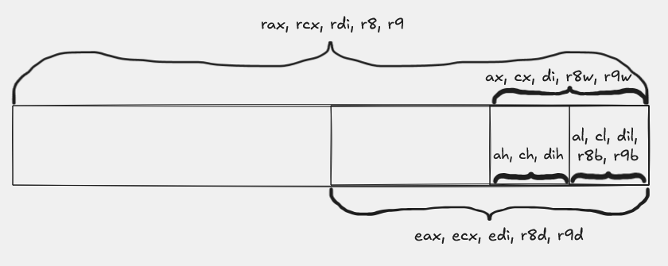

# Основна синтакса `x86-64` архитектуре

## Архитектура и асемблер

Асемблер је језик врло ниског нивоа. Готово све написане инструкције директно се кодирају у машинске инструкције које ће се извршавати на процесору. Зато различите архитектуре процесора имају различите асемблерске језике.

У првом делу курса посветићемо се Intel-овој `x86-64` архитектури, која је доминантна у свету персоналних рачунара. Компаније AMD и Intel производе процесоре засноване на овој архитектури, па је врло вероватно да се и на вашем рачунару налази управо такав процесор.

## Регистри опште намене

Архитектура `x86-64` је 64-битна, што значи да су меморијске адресе представљене са 8 бајтова. Поред радне меморије којој приступамо преко адреса, архитектура дефинише и 16 64-битних регистара опште намене:

`rax`, `rbx`, `rcx`, `rdx`, `rdi`, `rsi`, `rbp`, `rsp`, `r8`, `r9`, `r10`, `r11`, `r12`, `r13`, `r14`, `r15`

Неки од ових регистара имају посебне намене, али ћемо их детаљније обрађивати касније. Када не желимо да радимо са осмобајтним подацима, могуће је приступити и само делу регистра. На пример, регистру `rax` можемо приступити и као `eax`, `ax` или `al`, у зависности од величине податка који користимо.

У пракси ћемо на почетку курса најчешће сретати следеће регистре. Последња колона описује њихову честу улогу при раду на Linux `x86-64` систему, али треба имати у виду да регистар можемо користити и у друге сврхе ако нам то инструкције и конвенција позива дозвољавају.

| 64-битни | 32-битни | 16-битни | 8-битни | Честа улога |
| --- | --- | --- | --- | --- |
| `rax` | `eax` | `ax` | `al` | повратна вредност функције; често и акумулатор у аритметици |
| `rbx` | `ebx` | `bx` | `bl` | регистар опште намене; често се чува између позива функција |
| `rcx` | `ecx` | `cx` | `cl` | аргумент функције; често бројач или помоћни регистар |
| `rdx` | `edx` | `dx` | `dl` | аргумент функције; често помоћни регистар у аритметици |
| `rdi` | `edi` | `di` | `dil` | први целобројни или показивачки аргумент функције |
| `rsi` | `esi` | `si` | `sil` | други целобројни или показивачки аргумент функције |
| `rbp` | `ebp` | `bp` | `bpl` | база стек оквира, ако функција користи frame pointer |
| `rsp` | `esp` | `sp` | `spl` | врх стека |
| `r8`  | `r8d`  | `r8w`  | `r8b`  | пети целобројни или показивачки аргумент функције |
| `r9`  | `r9d`  | `r9w`  | `r9b`  | шести целобројни или показивачки аргумент функције |

Следећа слика приказује како су обележени делови неколико често коришћених регистара:



*Слика показује да се исти физички регистар може посматрати као 64-битни, 32-битни, 16-битни или 8-битни регистар, у зависности од инструкције коју користимо. Исти образац важи и за остале регистре опште намене, а не само за приказане примере.*

### Величина податка и подрегистри

У примерима са типом `int` најчешће ћемо користити 32-битне подрегистре као што су `eax`, `edi` и `esi`, јер `int` на Linux `x86-64` систему уобичајено заузима 4 бајта.

Важно правило је следеће: када инструкција упише вредност у 32-битни подрегистар, на пример у `eax`, горњих 32 бита одговарајућег 64-битног регистра `rax` аутоматски се постављају на нулу.

## Основна конвенција позива на Linux `x86-64`

Да би једна функција могла да позове другу, обе морају да се договоре где стижу аргументи, где се враћа резултат и које регистре смеју да покваре. Та правила називамо **конвенција позива**.

У примерима са целобројним и показивачким аргументима на Linux `x86-64` систему за нас су најважнија следећа правила:

| Улога | Регистри |
| --- | --- |
| Првих шест целобројних / показивачких аргумената | `rdi`, `rsi`, `rdx`, `rcx`, `r8`, `r9` |
| Повратна вредност | `rax` |
| Регистри које функција мора да сачува ако их мења | `rbx`, `rbp`, `r12`, `r13`, `r14`, `r15` |
| Регистри које позив функције сме да поквари | `rax`, `rcx`, `rdx`, `rdi`, `rsi`, `r8`, `r9`, `r10`, `r11` |

Зато у примеру `saberi(int a, int b)` аргументи стижу у `edi` и `esi`, а резултат се враћа преко `eax`. У примеру `puts(msg)` адреса ниске стиже у `rdi`, јер је то први аргумент функције.


*Слика треба да прикаже првих шест аргумената, регистар за повратну вредност и поделу на caller-saved и callee-saved регистре.*

## Врсте линија у асемблеру

У асемблеру линије кода најчешће припадају једној од следећих група:

- **Лабеле** служе да именујемо делове кода или меморије. Састоје се од идентификатора након ког стоје две тачке. Идентификатор може бити свако име које би било валидно и за променљиву у C++-у.
- **Директиве** описују како асемблер треба да тумачи следећи део кода. Почињу тачком и често не представљају инструкције процесора, већ упутства асемблеру.
- **Инструкције** представљају стварне операције које ће процесор извршавати.
- **Коментари** служе за објашњење кода и у овом дијалекту асемблера почињу знаком `#`.

## Честе директиве

Неке од директива које ћемо често користити су:

- `.intel_syntax noprefix` одређује да користимо Intel-ов дијалекат асемблера.
- `.text`, `.data`, `.rodata`, `.bss` одређују у коју секцију треба сместити инструкције или податке који следе.
- `.global ime` означава да симбол `ime` има спољашње повезивање и да може бити видљив и другим преводилачким јединицама.
- `.asciz`, `.quad`, `.byte` описују величину и облик података који се уписују.
- `.section .note.GNU-stack,"",@progbits` не представља инструкцију процесора, већ напомену алатима приликом линковања да програму није потребан извршив стек.

## Врсте операнада

Инструкције имају име и одређен број операнада. Неке инструкције немају експлицитне операнде, док друге користе један, два или више њих. По типу, операнди могу бити:

- непосредни, када наводимо тачну вредност, на пример `42`
- регистарски, када наводимо регистар у ком се вредност налази, на пример `eax`
- меморијски, када наводимо адресу или израз који описује локацију у меморији, на пример `[rdi + 4 * rcx]`

### Примери меморијских операнада

У уводним примерима често ћемо сретати облике као што су:

- `[rbp-4]`, што значи "меморијска локација 4 бајта испод базе текућег стек оквира"
- `[rbp-8]`, што значи "меморијска локација 8 бајтова испод `rbp`"
- `[rip+msg]`, што значи "адреса симбола `msg` релативно у односу на тренутну инструкцију"

На пример:

```asm
mov [rbp-4], edi
mov eax, [rbp-8]
lea rdi, [rip+msg]
```

У првој линији вредност из регистра `edi` уписујемо у меморију. У другој линији вредност из меморије учитавамо у `eax`. Пошто је одредиште `eax`, асемблер зна да се ради о 4 бајта. У трећој линији не читамо садржај меморије, већ рачунамо адресу симбола `msg`.

### `mov` и `lea` нису иста ствар

Инструкција `mov` обично премешта саму вредност. На пример:
```asm
mov eax, [rbp-4]
```

значи "прочитај вредност из меморије на адреси `rbp-4` и упиши је у `eax`".

С друге стране,

```asm
lea rdi, [rip+msg]
```

значи "израчунај адресу симбола `msg` и упиши ту адресу у `rdi`". Зато `lea` врло често користимо када функцији треба да проследимо показивач, а не сам садржај на тој адреси.

## Инструкције `call` и `ret`

Инструкција

```asm
call funkcija
```

уписује повратну адресу на стек и преноси управљање на `funkcija`.

Инструкција

```asm
ret
```

чита ту повратну адресу са стека и враћа извршавање позиваоцу.

Због тога функција која позива неку другу функцију мора да води рачуна о стеку и његовом поравнању. Први пут ћемо то видети у примеру [Hello world](../02-hello-world/README.md).

## Даље

- Претходно: [Организација извршног кода](./01-organizacija-izvrsnog-koda.md)
- Следеће: [Сабирање](../01-sabiranje/README.md)
- Изворни код првог примера: [main.cpp](../01-sabiranje/main.cpp), [saberi.s](../01-sabiranje/saberi.s), [saberi-sa-stek-okvirom.s](../01-sabiranje/saberi-sa-stek-okvirom.s)
- Наредни пример: [Hello world](../02-hello-world/README.md), [hello.cpp](../02-hello-world/hello.cpp), [hello.s](../02-hello-world/hello.s)
