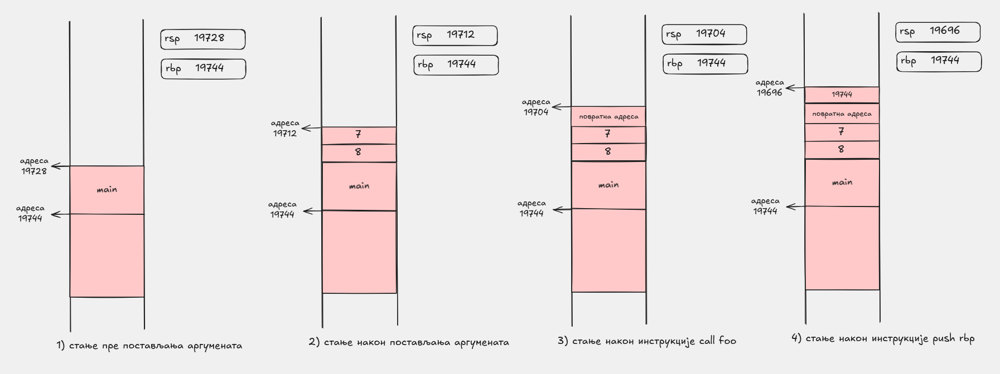

# Пренос аргумената

Подсећање: већ смо видели где завршава првих шест `int` аргумената функције. У овом `x86-64` примеру они иду редом у `edi`, `esi`, `edx`, `ecx`, `r8d` и `r9d`.

Овде гледамо шта се дешава после тога: седми, осми и сваки наредни аргумент стављају се на стек, и то у обрнутом редоследу.

## Шта програм ради

`main.cpp` позива:

```cpp
foo(1, 2, 3, 4, 5, 6, 7, 8);
```

Затим исписује повратну вредност функције. Асемблерска функција `foo` чита осми аргумент са стека и враћа га, па је излаз програма `8`.

## Датотеке

- `main.cpp` позива `foo` са осам `int` аргумената и исписује резултат
- `foo.s` прави класичан стек оквир и чита осми аргумент преко `[rbp + 24]`

## Шта се види у `main`

Ако погледамо disassembly функције `main`, видећемо суштину позива:

```asm
push 8
push 7
mov r9d, 6
mov r8d, 5
mov ecx, 4
mov edx, 3
mov esi, 2
mov edi, 1
call foo
add rsp, 16
```

Ово јасно показује:

- првих шест `int` аргумената завршавају у регистрима
- преостали аргументи иду на стек у обрнутом редоследу: прво се ставља `8`, па `7`
- после позива се стек чисти инструкцијом `add rsp, 16`

Ово можемо видети и помоћу алата Compiler Explorer на следећем линку:

[https://godbolt.org/z/c4McWczcs](https://godbolt.org/z/c4McWczcs)


## Слика распореда аргумената

Следећа слика приказује распоред регистара и стека током позива функције `foo`:




На овој слици видимо стање регистара и меморије у четири тренутка:

1. пре намештања аргумената за `foo`
2. непосредно пре `call foo`
3. одмах после `call`, пре `push rbp` у `foo`
4. после `push rbp`

У тим фазама треба уочити:

- пре `call` регистри `edi`, `esi`, `edx`, `ecx`, `r8d`, `r9d` већ држе вредности `1` до `6`
- пре `call` су `7` и `8` већ на стеку, при чему је `7` на `[rsp]`, а `8` на `[rsp+8]`
- одмах после `call` повратна адреса је на `[rsp]`, па се `7` и `8` померају на `[rsp+8]` и `[rsp+16]`
- после `push rbp` се `7` и `8` налазе на адресама `[rsp+16]` и `[rsp+24]`
    - након инструкције `mov rbp, rsp` oвим аргументима приступамо преко `[rbp+16]` и `[rbp+24]`

## Шта треба посматрати у `foo`

Пошто `foo` прави класичан стек оквир:

```asm
push rbp
mov rbp, rsp
```

осми аргумент читамо преко:

```asm
mov rax, [rbp + 24]
```

То ради зато што се после постављања оквира на стеку редом налазе:

- стара вредност `rbp` на `[rbp]`
- повратна адреса на `[rbp+8]`
- седми аргумент на `[rbp+16]`
- осми аргумент на `[rbp+24]`

## Превођење

```sh
g++ -O0 main.cpp foo.s
```

## Покретање

```sh
./a.out
```

Очекивани излаз је:

```text
8
```

## На шта треба обратити пажњу

- конкретне инструкције у `main` могу мало да варирају између компајлера и нивоа оптимизације, али распоред аргумената остаје исти
- приступ аргументима преко стека постаје важан чим пређемо шест целобројних параметара

## Навигација

- Претходно: [Недеља 2](../README.md)
- Следеће: [Максимум два броја](../02-max/README.md)
