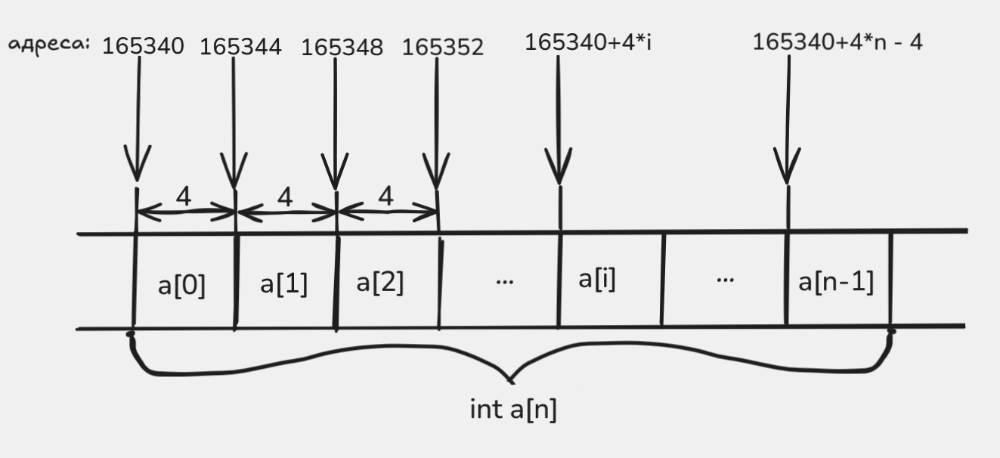

# Сума елемената низа

Овај пример уводи најважнији образац за рад са низом: имамо базну адресу, индекс и скалу која зависи од величине елемента.

## Шта програм ради

Програм учитава дужину низа, затим његове елементе и исписује њихов збир.

Референтна C++ функција може да изгледа овако:

```cpp
int suma_niza(int* niz, int n) {
    int suma = 0;
    for (int i = 0; i < n; i++) {
        suma += niz[i];
    }
    return suma;
}
```

## Датотеке

- `main.cpp` чита `n`, затим `n` елемената и позива `suma_niza`
- `suma.s` пролази кроз низ и акумулира збир у `eax`

## Шта треба посматрати у асемблеру

Адреса првог елемента стиже у `rdi`, а број елемената у `esi`. Индекс чувамо у `ecx`.

Кључна инструкција је:

```asm
    add eax, [rdi + 4*rcx]
```

Она значи:

- крени од базне адресе `rdi`
- помери се за `4 * i` бајтова
- прочитај `int` на тој адреси
- додај га на текућу суму у `eax`

Ово је конкретан случај општег обрасца `baza + indeks * velicina_elementa`.

Визуелизација исте идеје:



На слици се види да базна адреса остаје иста, а да индекс одређује колики померај у бајтовима треба додати да бисмо дошли до елемента `a[i]`.

Пошто један `int` заузима `4` бајта, множилац уз индекс је баш `4`. Важно је и да процесор померај увек рачуна у бајтовима: ако је `i = 3`, адреса елемента није `rdi + 3`, него `rdi + 12`, јер је то адреса елемента `a[3]`.

## Превођење

```sh
g++ main.cpp suma.s
```

## Покретање

```sh
./a.out
```

Пример интеракције:

```text
5
1 2 3 4 5
15
```

## На шта треба обратити пажњу

- ово је први пример где један регистар чувамо као базу низа, а други као индекс
- запис `[rdi + 4*rcx]` је исти онај образац `baza + indeks * velicina_elementa` који ћемо касније често виђати у свим задацима са низовима
- кад се индекс увећа за `1`, адреса се не помери за `1` бајт него за величину једног елемента низа
- у овој недељи код задатака са низовима фокус је на адресирању елемената, па подразумевамо да је улазни `n > 0`

## Навигација

- Претходно: [Замена две вредности](../01-swap/README.md)
- Следеће: [Максимум низа](../03-maksimum/README.md)
- Горе: [Недеља 4](../README.md)
