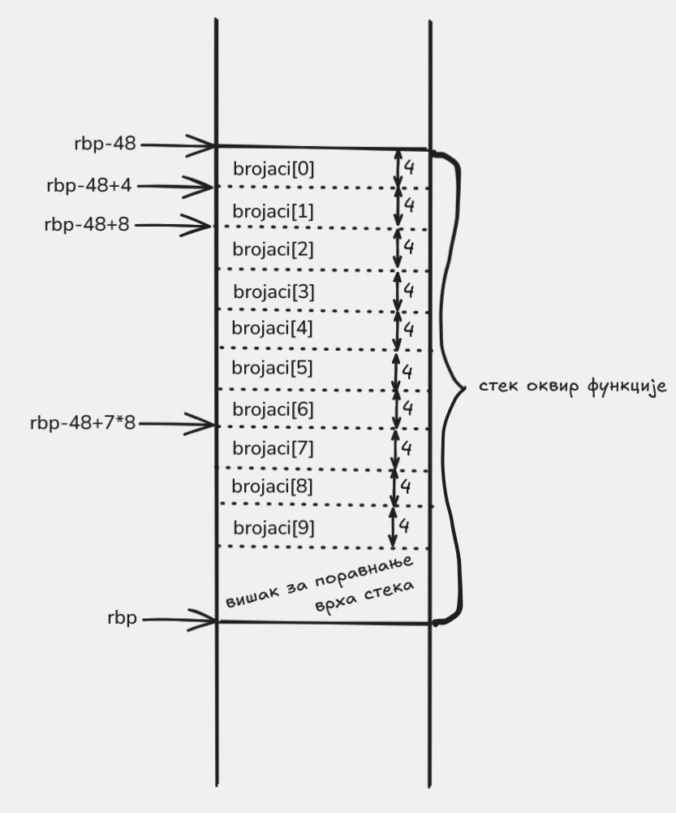

# Најчешћа цифра

Ово је најбогатији пример у недељи: унутар функције правимо локални низ бројача, пунимо га, а затим тај низ прослеђујемо помоћној функцији која тражи индекс максималног елемента.

## Шта програм ради

Програм учитава један `unsigned` број и исписује цифру која се у његовом декадном запису јавља највише пута.

Ако више цифара има исту максималну учесталост, враћа се најмања од њих. То се дешава зато што помоћна функција враћа први индекс на ком се појављује максимум.

Референтна C++ верзија могла би да изгледа овако:

```cpp
unsigned indeks_maksimuma(unsigned* a, unsigned n) {
    if (n == 0) {
        return 0;
    }

    unsigned indeks = 0;
    for (unsigned i = 1; i < n; i++) {
        if (a[indeks] < a[i]) {
            indeks = i;
        }
    }
    return indeks;
}

unsigned najcesca_cifra(unsigned n) {
    unsigned brojaci[10] = {};

    if (n == 0) {
        brojaci[0] = 1;
    }

    while (n != 0) {
        brojaci[n % 10]++;
        n /= 10;
    }

    return indeks_maksimuma(brojaci, 10);
}
```

## Датотеке

- `main.cpp` чита број и исписује резултат функције `najcesca_cifra`
- `najcesca_cifra.s` прави локални низ бројача и попуњава га
- `indeks_maksimuma.s` враћа индекс првог максималног елемента у низу

## Шта треба посматрати у асемблеру

Овај пример је најлакше читати у четири јасне фазе.

### 1. Нулирање локалног низа бројача

У `najcesca_cifra` локални низ бројача живи на стеку. Зато функција прави већи стек оквир:

```asm
    enter 48, 0
```

Од тих `48` бајтова:

- `40` бајтова иде на `10` бројача типа `unsigned`
- преосталих `8` бајтова служи да стек остане правилно поравнат пре `call`

Визуелизација тог стек оквира:



Слика помаже да се јасно раздвоје `40` бајтова за `brojaci[0]` до `brojaci[9]` од додатних `8` бајтова који су ту само због поравнања стека.

После тога петља за иницијализацију уписује нуле у свих `10` елемената локалног низа.

### 2. Посебан случај `n == 0`

Ако је улазни број баш `0`, не улазимо у петљу са дељењем, него ручно бележимо да се цифра `0` појавила једном:

```asm
    mov dword ptr [rbp - 48], 1
```

### 3. Издвајање цифре и увећање одговарајућег бројача

Када издвојимо последњу цифру, она завршава у `edx` као остатак при дељењу са `10`, па тај остатак одмах користимо као индекс у низу бројача:

```asm
    div r8d
    add dword ptr [rbp + 4 * rdx - 48], 1
```

То је суштина целог примера: остатак при дељењу са `10` није само „последња цифра“, него и директан индекс у низу `brojaci`.

### 4. Позив помоћној функцији која тражи индекс максимума

После попуњавања бројача позивамо помоћну функцију:

```asm
    lea rdi, [rbp - 48]
    mov esi, 10
    call indeks_maksimuma
```

Тиме се лепо види да локални низ на стеку можемо да третирамо исто као и било који други низ: довољно је да проследимо адресу првог елемента.

Код изједначења је важан и детаљ о редоследу: `indeks_maksimuma` ажурира индекс само кад нађе строго већи елемент. Зато при истом броју појављивања остаје ранији индекс, а у низу `brojaci[0] ... brojaci[9]` то значи мања цифра.

## Превођење

```sh
g++ main.cpp najcesca_cifra.s indeks_maksimuma.s
```

## Покретање

```sh
./a.out
```

Пример интеракције:

```text
2024050400
0
```

## На шта треба обратити пажњу

- ово је први пример у ком локални низ правимо ручно унутар асемблерске функције
- остатак дељења са `10` постаје индекс цифре коју бројимо
- случај `n = 0` мора посебно да се обради, јер број `0` има једну цифру `0`
- помоћна функција је издвојена у посебан фајл, тако да се јасно одвоје „попуни бројаче“ и „пронађи индекс максимума“
- „први максимум“ овде значи „најмања цифра са максималном учесталошћу“, јер су бројачи поређани редом од `0` до `9`

## Навигација

- Претходно: [Максимум низа](../03-maksimum/README.md)
- Следеће: [Обртање низа](../05-obrni-niz/README.md)
- Горе: [Недеља 4](../README.md)
