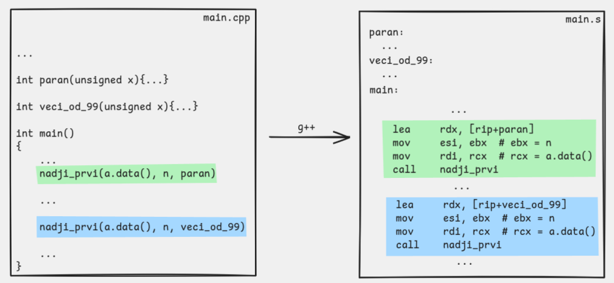

# Нађи први

Ово је пример у ком функција добија адресу друге функције као аргумент и онда ту функцију позива индиректно.

## Шта програм ради

Функција `nadji_prvi` пролази кроз низ и враћа индекс првог елемента који задовољава прослеђену predicate функцију. Ако такав елемент не постоји, враћа `-1`.

Референтна C++ верзија могла би да изгледа овако:

```cpp
int nadji_prvi(unsigned* a, int n, int (*pred)(unsigned)) {
    for (int i = 0; i < n; i++) {
        if (pred(a[i])) {
            return i;
        }
    }
    return -1;
}
```

Рана завршница је део понашања функције: чим `pred(a[i])` врати ненула вредност, враћамо тај индекс и не гледамо остатак низа. Зато резултат није било који погодак, него индекс првог елемента који задовољава услов.

Када из `main.cpp` позовемо `nadji_prvi(a.data(), n, paran)`, трећи аргумент није резултат неке провере, него сама адреса функције `paran`. `nadji_prvi` ту адресу прима, чува и у свакој итерацији је позива над текућим елементом низа.

## Датотеке

- `main.cpp` учитава низ и позива `nadji_prvi` са две различите predicate функције
- `nadji_prvi.s` садржи асемблерску имплементацију функције

## Шта треба посматрати у асемблеру

На уласку у функцију трећи аргумент, односно адреса predicate функције, стиже у `rdx`. Пошто је то вредност која нам треба у свакој итерацији, смештамо је у локалну променљиву у стек оквиру:

```asm
mov [rbp - 16], rdx
```

Исто радимо и са базом низа, дужином и текућим индексом. То омогућава да се после сваког `call` лако вратимо на исто стање петље:

```asm
mov [rbp - 8], rdi
mov [rbp - 16], rdx
mov [rbp - 20], esi
mov dword ptr [rbp - 24], 0
```

Пре индиректног позива текући елемент `a[i]` смештамо у `edi`, баш као да позивамо обичну именовану функцију. Функција `pred` затим враћа резултат у `eax` по истој конвенцији позива као и свака друга функција:

```asm
mov edi, [rax + 4 * rcx]
call [rbp - 16]
```

Код `call [rbp - 16]` циљ није симбол познат по имену, него адреса функције која је тренутно смештена у меморији на датој позицији стек оквира.

На слици испод можемо видети како се ова адреса прослеђује из функције `main`. Инструкцијом `lea` у регистар `rdx` уписујемо адресу на коју се односи лабела са именом фунцкије (врло слично примеру [Hello world!](../../01-uvod/02-hello-world/README.md)).



> **Напомена:** Инструкције које видимо на слици могу се разликовати у зависности од компајлера и опција које користимо, али ће семантички поступак прослеђивања адресе функције остати исти.


## Превођење

```sh
g++ main.cpp nadji_prvi.s
```

## Покретање

```sh
./a.out
```

Пример интеракције:

```text
6
11 15 18 21 130 7
prvi paran: indeks 2
prvi > 99: indeks 4
```

## На шта треба обратити пажњу

- ово је први пример са индиректним `call`
- predicate функција и даље користи исту конвенцију позива као и свака друга функција: аргумент у `edi`, повратна вредност у `eax`
- `-1` је природан сигнал да ниједан елемент није задовољио услов
- стање петље чувамо у стек оквиру баш зато да бисмо после сваког индиректног `call` могли да наставимо тамо где смо стали

## Навигација

- Претходно: [Опсег низа](../02-opseg/README.md)
- Следеће: [Рекурзивни факторијел](../04-faktorijel_rekurzivno/README.md)
- Горе: [Недеља 5](../README.md)
